# Food Shop 🏪
A Food Shop app with web admin panel.

><b>Platforms:</b> Android, iOS, Web <b>Language/SDK:</b> Dart, Flutter

## **🎈 Screenshots**
### **Admin App 🌐**
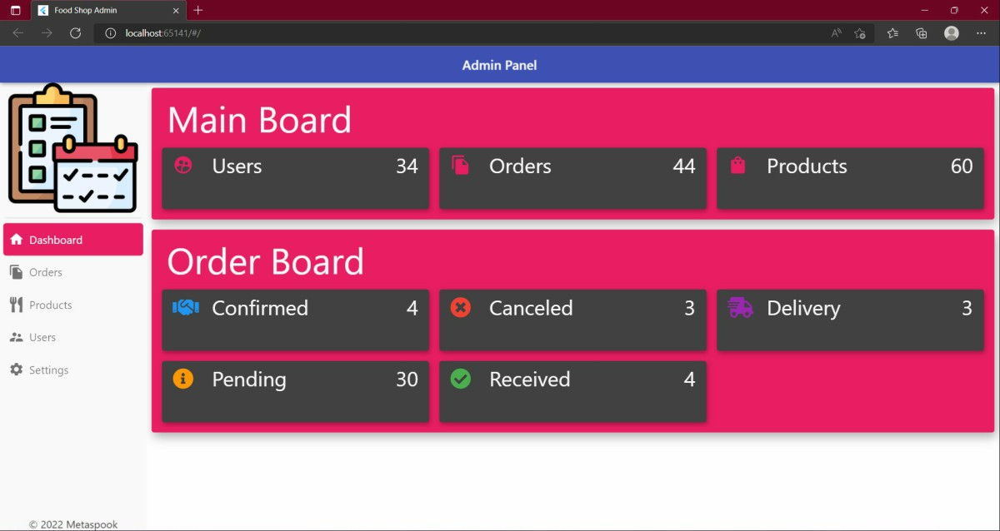&emsp;
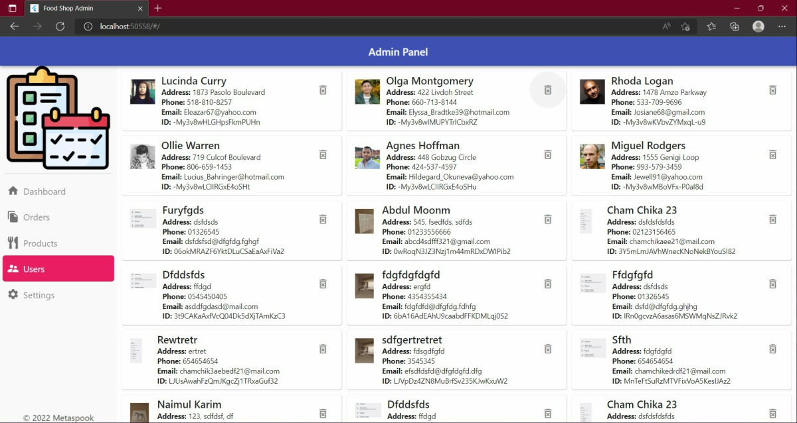&emsp;
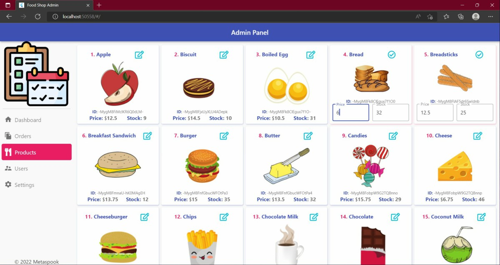&emsp;
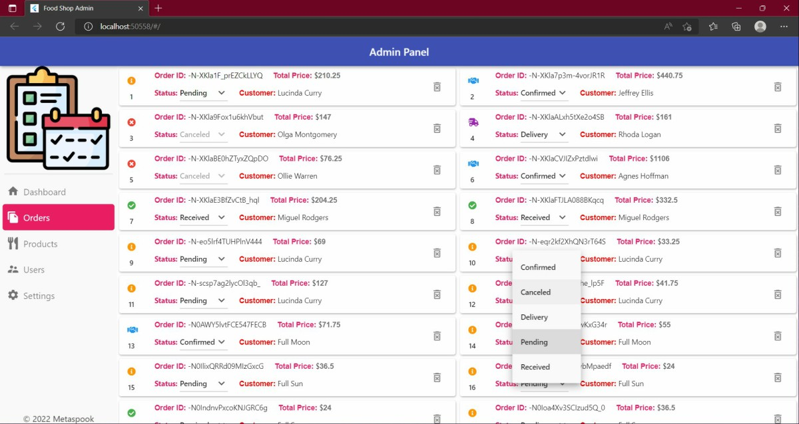&emsp;
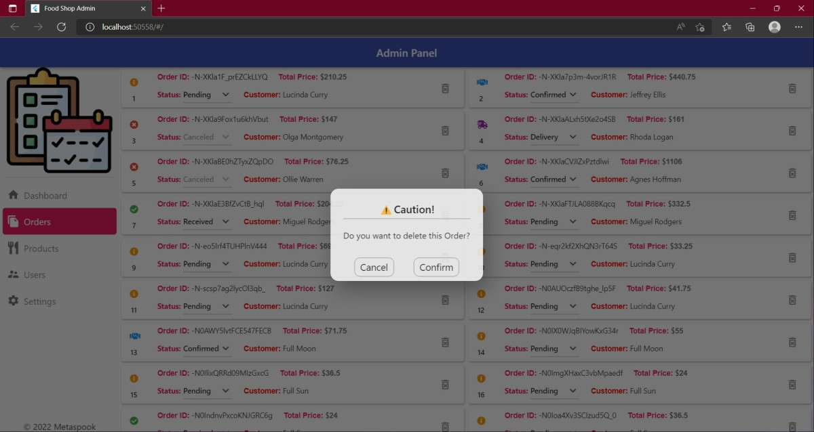&emsp;
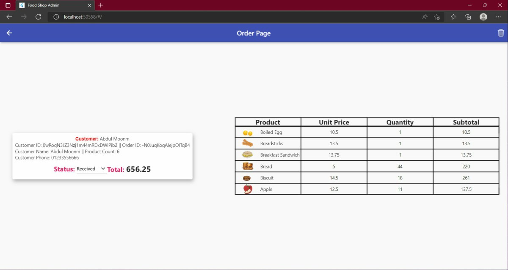&emsp;

### **Customer App 📱**
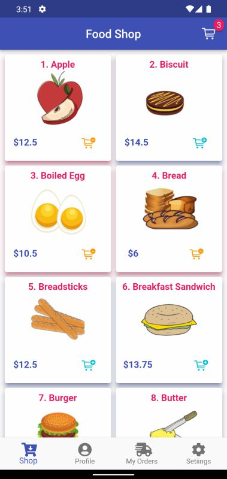&emsp;
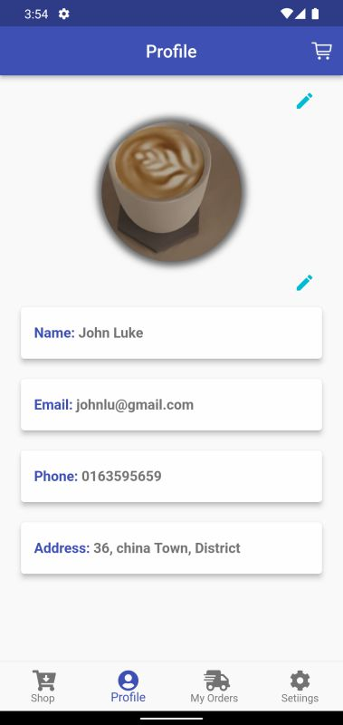&emsp;
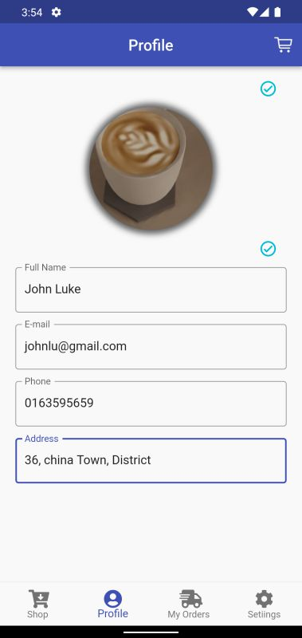&emsp;
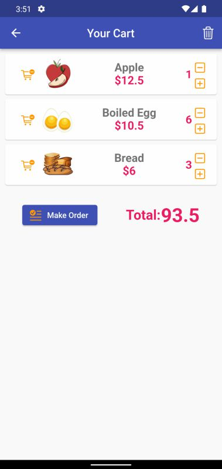&emsp;
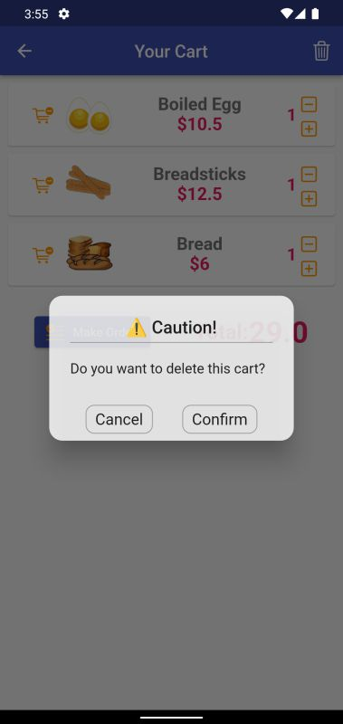&emsp;
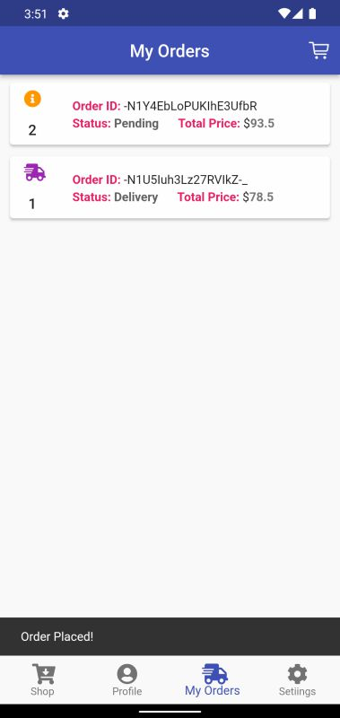&emsp;
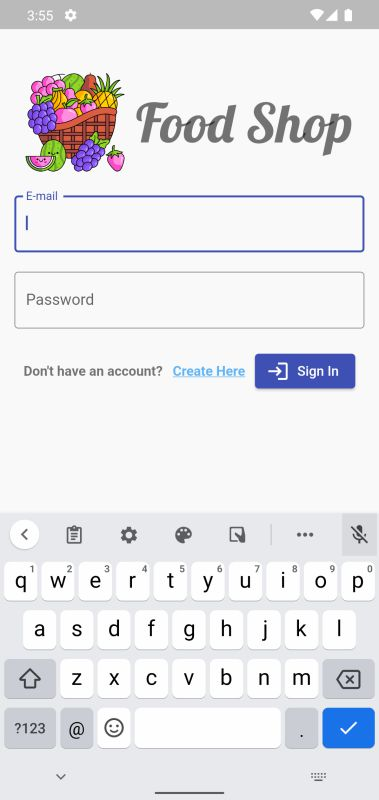&emsp;
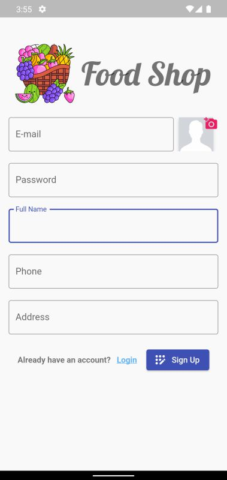&emsp;
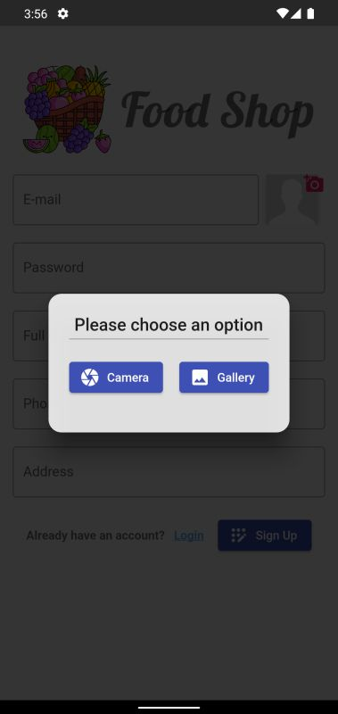&emsp;
&emsp;
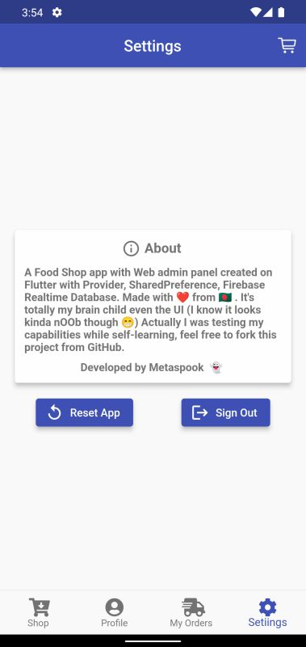 

## **🎈 Features**
#### **Admin App 🌐**
* App wide Realtime data.
* Dashboard.
* Editable Products View.
* Deletable Users View.
* Status updatable Orders view.
* Orders details page.
#### **Customer App 📱**
* SignIn and SignOut views.
* Image picker and cropper for sign up.
* Form validations.
* Products View.
* Editable Profile view.
* Cart page featured item remover and quantity updater.
* Persisting Cart in Shared preference until order.
* Orders view.
* SignOut, Reset and about in settings.
* Other more features..
#### **Commons 🎗️**
* App wide Realtime data.
* Firebase Realtime Database.
* Provider state management.
* MVC+S Architecture.
* Shared preference as Local DB.

## **🎈 Instructions**
* Get your Firebase credentials from 'google-services.json' file.
* Open 'lib/firebase_options.placeholder', follow the instructions above.

## **🎈 Remarks**

Click to collapse/fold.

* Packages: provider, badges, cached_network_image, easy_sidemenu, font_awesome_flutter, image_picker, image_cropper, firebase_storage, firebase_core, firebase_auth, firebase_database, validators, google_fonts.

